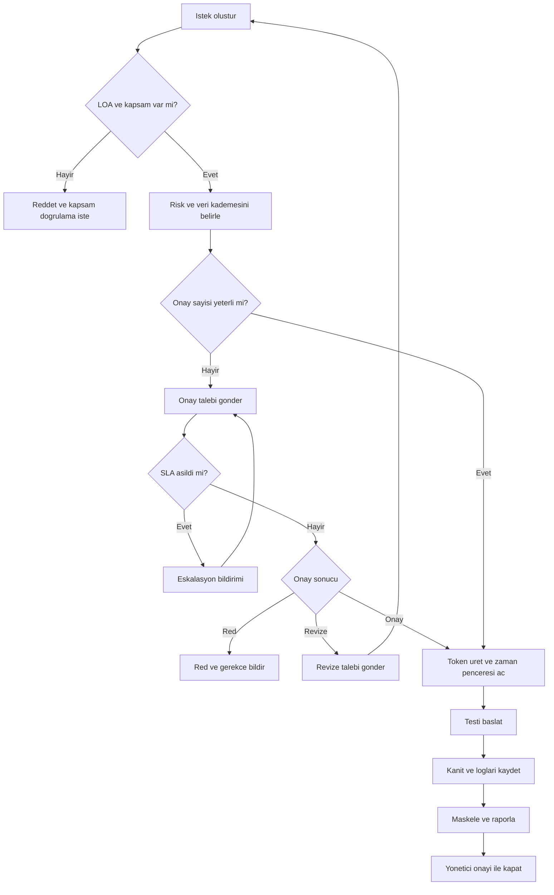

# SiberEmare — Pentest Rapor Asistanı Proje Dokümanı

**Versiyon:** 1.0  
**Tarih:** Mart 2026  
**Hazırlayan:** SiberEmare Ekibi

---

## İçindekiler

1. [Asistanın görevini netleştir](#1-asistanın-görevini-netleştir-tek-cümle)
2. [RAG: bilgi bankan](#2-eğitim-yerine-önce-rag-senin-bilgi-bankan)
3. [Çıktı formatlarını standardize et](#3-asistanın-çıktı-formatlarını-standardize-et)
4. [Güvenlik ve etik guardrail'ler](#4-güvenlik-ve-etik-guardrailller-çok-önemli)
5. [Fine-tuning ne zaman gerekli?](#5-fine-tuning-ne-zaman-gerekli)
6. [Teknik mimari](#6-teknik-mimari-pratik-öneri)
7. [Değerlendirme](#7-değerlendirme-asistan-iyi-mi-nasıl-anlarsın)
8. [Minimum yapılacaklar](#8-bugün-başlayabilmen-için-minimum-yapılacaklar)
9. [Ürün kapsamı ve hedefler](#9-ürün-kapsamı-ve-hedefler)
10. [Veri gizliliği ve uyum](#10-veri-gizliligi-ve-uyum)
11. [RAG tasarım ayrıntıları](#11-rag-tasarim-ayrintilari)
12. [Prompt ve output schema](#12-prompt-ve-output-schema)
13. [Uygulama planı ve takvim](#13-uygulama-plani-ve-takvim)
14. [Test ve kalite güvencesi](#14-test-ve-kalite-guvencesi)
15. [Çok iyi korunan sistemlerde bulgu anlatımı](#15-cok-iyi-korunan-sistemlerde-bulgu-anlatimi)
16. [Bulgu yazım şablonu](#16-bulgu-yazim-sablonu-tam-metin)
17. [RAG klasör yapısı](#17-rag-klasor-yapisi-ve-dosya-isimlendirme)
18. [System ve guardrail prompt](#18-system-ve-guardrail-prompt-tam-taslak)
19. [Örnek bulgu (doldurulmuş)](#19-ornek-bulgu-doldurulmus)
20. [KVKK/GDPR uyum kontrol listesi](#20-kvkkgdpr-uyum-kontrol-listesi-ozet)
21. [KPI tablosu](#21-kpi-tablosu-olculebilir-hedefler)
22. [Yetkili sızma testi operasyonel hazırlık](#22-yetkili-sizma-testi-operasyonel-hazirlik)
23. [PentestX: kademeli test çerçevesi](#23-pentestx-kademeli-izinli-test-cercevesi-konsept)
24. [Sonuç ve yol haritası](#24-sonuc-ve-yol-haritasi)
25. [Orchestrator — tek komut motoru](#25-orchestrator--tek-komut-motoru)
26. [Runbook tabanlı modül yönetimi](#26-runbook-tabanli-modul-yonetimi)
27. [Plan modu ve Zero Trust onay](#27-plan-modu-ve-zero-trust-onay)
28. [Kanıt paketleme standardı](#28-kanit-paketleme-standardi-evidence-bundle)
29. [Redaction fail-closed](#29-redaction-fail-closed)
30. [Normalized output schema v1](#30-normalized-output-schema-v1)
31. [Bulgu → çözüm kataloğu](#31-bulgudan-cozume-katalog)
32. [CI'da otomatik kalite ölçümü](#32-cida-otomatik-kalite-olcumu)
33. [Kapsam dışı koruması — CLI guardrail](#33-kapsam-disi-korumasi--cli-guardrail)
34. [Dağıtık test — Emare Hub filo entegrasyonu](#34-dagitik-test--emare-hub-filo-entegrasyonu)
35. [Multi-Agent Orchestrator — LangGraph](#35-multi-agent-orchestrator--langgraph)
36. [GraphRAG + saldırı yolu haritalama](#36-graphrag--saldiri-yolu-haritalama)
37. [Multimodal Vision RAG](#37-multimodal-vision-rag)
38. [Müşteri profili vektörü](#38-musteri-profili-vektoru)
39. [Gold-Standard feedback loop + DSPy](#39-gold-standard-feedback-loop--dspy)
40. [Gerçek zamanlı tehdit istihbaratı](#40-gercek-zamanli-tehdit-istihbarati)
41. [Otomatik remediation script üreteci](#41-otomatik-remediation-script-ureteci)
42. [Interactive HTML rapor + version diff](#42-interactive-html-rapor--version-diff)
43. [Blockchain audit ledger](#43-blockchain-audit-ledger)
44. [Dynamic LLM router + maliyet optimizasyonu](#44-dynamic-llm-router--maliyet-optimizasyonu)
45. [Sentetik senaryo üreteci](#45-sentetik-senaryo-ureteci)
46. [SIEM/Ticketing + SOAR entegrasyonu](#46-siemticketing--soar-entegrasyonu)

---

> **Temel yaklaşım:** Modeli sıfırdan fine-tune etmek yerine, kurum içi dokümanlar, süreçler ve şablonlarla **RAG tabanlı bir asistan** kurmak en etkili yoldur. Pentest işinde en iyi sonuç: *kurum içi bilgi + standartlar + rapor dili* birleşiminden çıkar.

Bu doküman, izinli sızma testi, önlem danışmanlığı ve raporlama alanına özel pratik bir yol haritası sunar.

---

## 1) Asistanın görevini netleştir (tek cümle)

Örnek net görev:

* “Bulguları OWASP/PTES’e göre sınıflandırıp CVSS + iş etkisi + çözüm önerisiyle raporlaştır.”
* “Müşteri için kapsam (scope), LOA, test planı ve rapor şablonlarını üret.”
* “Bulgu çıktılarından (Nmap/Burp/ZAP) yönetici özeti ve teknik ek üret.”

Bu, sonra guardrail’leri ve veri setini çok kolaylaştırır.

---

## 2) “Eğitim” yerine önce RAG: senin bilgi bankan

Pentest asistanında en büyük farkı RAG yapar çünkü:

* Sürekli güncellenir (playbook’lar, şablonlar, müşteri standartları)
* Gizli veriyi modele gömmezsin (sadece sorgu anında getirirsin)
* Halüsinasyonu azaltır (kanıtlı cevap)

### Bilgi bankasına koyacakların (yüksek değer)

* Kendi rapor şablonların (Executive summary, bulgu formatı)
* Standart çözüm önerileri kataloğu (ör: SQLi, IDOR, SSRF, misconfig vs.)
* Scope/LOA/NDA sözleşme maddeleri taslakları
* Kontrol listeleri: OWASP ASVS maddeleri, CIS benchmark notların, hardening checklists
* Müşteriye “önlemler” dokümanların (patch, MFA, logging, WAF, backup vb.)
* Geçmiş raporlardan **anonimleştirilmiş** bulgular + düzeltmeler

> Kritik: Müşteri isimleri, IP’ler, sistem detayları, erişim bilgileri **anonim / maskeli** olmalı.

---

## 3) Asistanın “çıktı formatlarını” standardize et

Asistanın iyi olmasını sağlayan şey “kısa prompt” değil, **sabit şablonlar**.

Örnek bulgu formatı (tek tip):

* Başlık
* Etki (iş etkisi + teknik etki)
* Olasılık
* CVSS (varsa)
* Kanıt/PoC (log/istek/yanıt kısa)
* Kök neden
* Çözüm (hemen/orta/uzun vade)
* Referans (OWASP, CWE)

Bu formatı bir “system instruction” olarak sabitle.

---

## 4) Güvenlik ve etik guardrail’ler (çok önemli)

Senin asistanın şu tür talepleri otomatik sınırlandırmalı:

* Yetkisiz hedeflere yönelik adım adım saldırı yönlendirmesi
* Zararlı kullanım (phishing içeriği, exploit üretimi, “şu hedefi kır” gibi)

Bunun yerine güvenli yönlendirme:

* Yasal çerçeve + kapsam doğrulama
* Savunma/iyileştirme önerileri
* Testin **izinli** olduğunu belirten bilgi isteği (sözleşme/LOA var mı?)

Bu, hem seni hem ürünü korur.

---

## 5) Fine-tuning ne zaman gerekli?

RAG çoğu işi çözer. Fine-tune ancak şu durumda değerli:

* Çok spesifik bir rapor “dilin” var ve bunu **tutarlı** üretmesini istiyorsun
* Sürekli aynı yapıdaki çıktıyı üretmesi gerekiyor (tone/format/terminoloji)
* Çok fazla örnek rapor (anonimleştirilmiş) birikti

Yine de çoğu senaryoda:

* **Prompt + RAG + Output schema** = fine-tune’dan daha hızlı ve güvenli

---

## 6) Teknik mimari (pratik öneri)

İki seçenek var:

### A) Bulut API (hızlı başlangıç)

* LLM API + vektör veritabanı (pgvector / Pinecone / Weaviate)
* Doküman ingest: PDF/DOCX/MD → chunk → embedding → index
* Uygulama: web panel / Slack / Teams bot

### B) On-prem / kapalı ortam (müşteri gizliliği yüksekse)

* Yerel LLM + yerel embedding modeli
* Local vector DB
* Log tutma + erişim kontrolü

> Pentest danışmanlığında bazı müşteriler **on-prem** ister; bunu avantaj olarak sunabilirsin.

---

## 7) Değerlendirme: “Asistan iyi mi?” nasıl anlarsın

Basit bir test seti hazırla (20–50 senaryo):

* 10 tane web bulgusu (IDOR, SQLi, SSRF, auth bypass, XSS…)
* 10 tane network bulgusu (SMB signing, weak TLS, exposed RDP…)
* 10 tane rapor/iletişim görevi (mail, executive summary, risk matrisi)

Skorla:

* Doğruluk (yanlış iddia var mı?)
* Kaynak gösterme (RAG kanıtı)
* Format tutarlılığı
* Güvenlik (yasadışı yönlendirme yapıyor mu?)

---

## 8) Bugün başlayabilmen için minimum yapılacaklar

1. “Rapor şablonunu” tek bir markdown dosyası haline getir
2. 30–50 adet “bulgu → çözüm” örneğini anonimize et
3. Bunları bir klasörde topla (knowledge base)
4. RAG ile arama + cevap üretme yap
5. Cevapları sabit formatta döndür (JSON schema veya başlık şablonu)

---

## 9) Ürün kapsamı ve hedefler

Bu asistanin ilk sürümü (MVP) net bir kapsamla daha hizli ve risksiz ilerler.

### Kapsam (MVP)

* Yetkili sızma testi bulgularını tek tip rapor formatında yazmak
* Yönetici özeti + teknik bulgu seti üretmek
* Kurum içi şablonlara (rapor dili/formatı) uyum sağlamak

### Kapsam disi (ilk aşamada)

* Otomatik exploit üretimi
* Canlı hedeflerde adım adım saldırı yönlendirmesi
* Müşteri ortamına doğrudan erişim gerektiren entegrasyonlar

### Başarı metrikleri (ornek)

* Rapor format tutarlılığı: %95+
* Hatalı/uydurma iddia oranı: %2 altı
* Kullanıcı memnuniyeti: 5 üzerinden 4+

---

## 10) Veri gizliligi ve uyum

Pentest verileri hassastir. Asistanın veri akışı ve saklama politikaları net olmalı.

### Temel ilkeler

* Müşteri verisi: Anonimleştirme ve maskeleme zorunlu
* Kayıt/Log: Minimum gerekli, belirli süreli saklama
* Erişim kontrolü: Rol bazlı ve denetlenebilir

### Uyum notlari (ornek)

* KVKK/GDPR için veri işleme amacı ve saklama süresi tanımlanmalı
* Raporlar dışarıya aktarılmadan önce PII taraması yapılmalı
* On-prem müşteriler için kapalı devre seçenek sunulmalı

---

## 11) RAG tasarim ayrintilari

RAG kalitesi büyük ölçüde parçalama ve arama stratejisine bağlıdır.

### Parçalama (chunking)

* Boyut: 500-900 token aralığı
* Overlap: %10-%20
* Şablon ve bulgu örnekleri ayrı segmentlenmeli

### Embedding ve arama

* Embedding modeli: metin tabanlı, Türkçe uyumlu
* Retrieval: Top-k + eşik (score threshold)
* Re-ranking: Mümkünse ikinci aşama sıralama

### Kaynak baglanti ve kanit

* Cevapların sonunda kullanılan kaynakları listele
* Kanit/PoC alanında referans chunk ID veya dokuman adı göster

---

## 12) Prompt ve output schema

Çıktı kalitesini sabitlemek için system + guardrail + format tanımı gerekir.

### System prompt (kisa taslak)

* Rol: Yetkili sızma testi rapor asistanı
* Ton: Net, resmi, kurumsal
* Kural: Kanıtsız iddia yok, kaynak göster

### Guardrail prompt (kisa taslak)

* Yasal kapsam doğrulama iste
* Yetkisiz hedeflerde adım adım saldırı verme
* Savunma ve iyileştirme odaklı yanıt ver

### Output schema (ornek)

* Başlık
* Etki (iş + teknik)
* Olasılık
* CVSS (varsa)
* Kanıt/PoC (kisa)
* Kök neden
* Çözüm (hemen/orta/uzun)
* Referans (OWASP/CWE)

---

## 13) Uygulama plani ve takvim

Basit bir 4 haftalik plan, hızlı sonuç için yeterlidir.

### Hafta 1

* Dokuman toplama ve anonimizasyon
* Rapor şablonlarının tekilleştirilmesi

### Hafta 2

* RAG ingest pipeline (chunk/embedding/index)
* Basit arayuz veya API katmani

### Hafta 3

* Prompt ve output schema sabitleme
* Örnek bulgu seti ile deneme

### Hafta 4

* Eval seti ile kalite testi
* Kurumsal kullanım için erişim ve log kurallari

---

## 14) Test ve kalite guvencesi

Sistematik test yapılmazsa rapor kalitesi tutarsızlaşır.

### Test seti

* 20-50 senaryo (web + network + rapor)
* Gerçek bulguların anonimleştirilmiş örnekleri

### Olcumler

* Doğruluk: yanlış iddia var mı
* Kaynak: RAG kaniti var mı
* Tutarlilik: format ve dil uyumu
* Guvenlik: yasadisi yonlendirme var mi

---

## 15) Cok iyi korunan sistemlerde bulgu anlatimi

Amac, nasil zorluklar asildigini aciklamak ama operasyonel adimlari vermeden
kurumu bilinclendirmek ve ayni hatalara dusmemelerini saglamaktir.

### Anlatim ilkeleri

* Adim adim saldiri tarifi verme
* Kanitli ve olculebilir ifade kullanma
* Kontrol zaafini ve is etkisini netlestirme

### Uygun dil ve kapsam (ornek yaklasim)

* Giris bariyerleri (MFA, WAF, segmentasyon) hangi zayif halka ile asildi
* Kullanilan acik siniflari (misconfig, yetki yonetimi, is mantigi hatasi)
* Koru/saldiri dengesi: hangi savunma neden yetersiz kaldı

### Rapor formatinda vurgulanacaklar

* Zayif nokta: Kontrol boslugu veya yanlis konfigurasyon
* Etki: Is surekliligi, veri gizliligi, itibar riski
* Kanit: Log/istek/yanit ozetleri (hassas veri maskeleme)
* Duzeltme: Onleme + algilama + iyilestirme

### Tipik acik siniflari (genel seviye)

* Kimlik ve yetki zafiyetleri (misconfigured SSO/MFA, zayif rol ayrimi)
* Is mantigi ve yetkilendirme atlamalari
* Yanlis veya eksik sertlestirme (hardening)
* Yanlis guven varsayimlari (ic ag guvenli kabul edilmesi)

### Ornek paragraf (kurumsal, operasyonel detay vermeyen)

Bu testte guclu savunma katmanlari (MFA, WAF, segmentasyon) mevcuttu. Buna
ragmen, belirli bir is akisi ve yetkilendirme kontrolu arasindaki uyumsuzluk
nedeniyle koruma katmanlari pratikte etkisiz kaldi. Bulgumuz, teknik ve is
etkisini kanitli sekilde ortaya koymakta; ozellikle ayni kategorideki benzer
akislarda riskin tekrarlama ihtimaline isaret etmektedir.

### Ornek paragraf (yonetici ozetine uygun)

Koruma mekanizmalari genel olarak etkin calissa da, kritik bir süreçte rol
ayrimi ve yetkilendirme kontrolleri beklenen seviyede uygulanamamistir. Bu
durum, hassas veri akislari icin yanlis guven varsayimi olusturmus ve is
etkisi yuksek bir risk dogurmustur. Oncelikli hedef, bu kontrol boslugunun
kalici olarak kapatilmasidir.

### Anonimlestirilmis bulgu ornekleri (genel seviye)

* Ornek 1: Yetkilendirme denetimi belirli bir islem tipinde atlandigi icin
	rol ayrimi pratikte islememis; bu nedenle yetkisiz erisim riski dogmus.
* Ornek 2: Guclu kimlik dogrulama bulunsa da, ikincil bir servis uzerinde
	erisim kontrolu beklenen seviyede uygulanmamis.
* Ornek 3: Segmentasyon mevcut olmasina ragmen, yanlis guven varsayimi ile
	ic agdaki servisler icin yeterli kontrol uygulanmamis.

### Yonetici ozeti sablonu (yuksek koruma ortami)

* Ozet: Guclu savunma katmanlarina ragmen, belirli bir kontrol boslugu
	nedeniyle yuksek etkili bir risk ortaya cikmistir.
* Is etkisi: [veri gizliligi / hizmet surekliligi / itibar riski]
* Neden: [kontrol uyumsuzlugu / yanlis konfigurasyon / is akisi tasarimi]
* Oncelik: Yuksek / Orta
* Oneri: [hemen uygulanacak duzeltme] + [orta vade iyilestirme]

---

## 16) Bulgu yazim sablonu (tam metin)

Bu sablon, bulgulari tek tip ve kurumsal bir dille raporlamak icin kullanilir.

### Baslik

[Kisa, net ve teknik baslik]

### Kapsam ve etkilenen varlik

[Sistem/uygulama/servis adi + kapsam notu]

### Ozet

[2-4 cumle ile riskin ozeti ve is etkisi]

### Teknik etki

[Ne olabilir? erisim, veri butunlugu, hizmet kesintisi]

### Olasilik

[Dusuk / Orta / Yuksek ve kisa gerekce]

### CVSS (varsa)

[Skor ve vektor]

### Kanit / PoC (maskeli)

[Istegi/yaniti ozetle, hassas alanlari maskele]

### Kok neden

[Kontrol boslugu, yanlis konfigurasyon veya is akisi tasarimi]

### Duzeltme ve iyilestirme

* Hemen: [hizli duzeltme]
* Orta vade: [sistematik iyilestirme]
* Uzun vade: [surec/yonetişim iyilestirmesi]

### Referanslar

* OWASP: [kategori]
* CWE: [kod]

---

## 17) RAG klasor yapisi ve dosya isimlendirme

Bilgi bankasi duzenli tutulursa RAG kalitesi ve guncelleme hizi artar.

### Ornek klasor yapisi

```
knowledge_base/
├── rapor_sablonlari/
│   ├── executive_summary.md
│   └── bulgu_sablonu.md
├── bulgu_katalogu/
│   ├── web/
│   │   ├── idor.md
│   │   └── sql_injection.md
│   └── network/
│       ├── weak_tls.md
│       └── smb_signing.md
├── kontrol_listeleri/
│   ├── owasp_asvs.md
│   └── cis_notes.md
├── sozlesme_ve_kapsam/
│   ├── loa_taslak.md
│   └── scope_taslak.md
├── kurum_ici_politikalar/
│   ├── logging_guidelines.md
│   └── hardening_checks.md
└── ornek_bulgular_anonim/
    ├── web/
    └── network/
```

### Dosya isimlendirme kurallari

* kucuk_harf_ve_alt_cizgi kullan
* dokuman_turu_konu.md seklinde adlandir
* musteri_adi veya hassas bilgi kullanma

---

## 18) System ve guardrail prompt (tam taslak)

Asagidaki taslaklar, rapor odakli ve guvenli yanitlar icin temel olur.

### System prompt (taslak)

Sen, yetkili sızma testi rapor asistanisin. Gorevin, saglanan kanitlar ve
RAG kaynaklari uzerinden kurumsal ve teknik bir dille rapor bolumleri
uretmek. Kanitsiz iddialardan kacın; her bulguyu kaynakla destekle. Cikti
formati, sabit bulgu sablonuna uyar.

### Guardrail prompt (taslak)

Yetkisiz hedeflere yonelik talimat, adim adim saldiri yontemi veya exploit
uretimine girmeden yanit ver. Yasal kapsam ve izin bilgisi yoksa kapsam
dogrulama iste. Guvenli alternatif olarak savunma, iyilestirme ve risk
azaltma onerileri sun.

---

## 19) Ornek bulgu (doldurulmus)

### Baslik

Yetkilendirme kontrol boslugu nedeniyle rol ayrimi ihlali

### Kapsam ve etkilenen varlik

Kurumsal is akisi modulunde rol bazli islem onayi

### Ozet

Guclu kimlik dogrulama mekanizmalari olmasina ragmen, belirli bir islem
akisi icinde rol ayrimi kontrolu tutarli uygulanmamistir. Bu durum, yetkisiz
islem onayi ve kritik verilerde istenmeyen degisiklik riskini dogurur.

### Teknik etki

Yetkisiz rol, onay gerektiren bir islem adimini tamamlayabilir. Bu durum,
veri butunlugu ve surec guvenilirligini zedeler.

### Olasilik

Orta. Kontrol boslugu belirli bir islem tipinde goruluyor ve surecli
incelemelerle tespit edilmesi zor.

### CVSS (varsa)

N/A (kurum icinde ek risk matrisi kullanildi)

### Kanit / PoC (maskeli)

Islem kaydinda rol X ile yapilan onay islemi kaydi goruldu. Loglarda
beklenen rol alanlari ile gerceklesmis islem rol bilgisi uyusmuyor.
Hassas alanlar maskeleme ile raporlanmistir.

### Kok neden

Is akisi tasariminda rol kontrolu sadece ilk adimda uygulanmis, ara adimlarda
kontrol tekrarlanmamistir.

### Duzeltme ve iyilestirme

* Hemen: Islem onayi adimlarinda rol kontrolunu zorunlu kil
* Orta vade: Rol denetimlerini merkezi bir politika servisine tasi
* Uzun vade: Is akisi guvenligi icin test otomasyonlari ekle

### Referanslar

* OWASP: Broken Access Control
* CWE: CWE-285

---

## 20) KVKK/GDPR uyum kontrol listesi (ozet)

Bu liste, pentest verilerinin islenmesi ve saklanmasi icin minimum gereksinimleri
hatirlatir.

### Veri isleme ve saklama

* Veri isleme amaci ve saklama suresi yazili
* PII maskeleme ve anonimlestirme proseduru var
* Log saklama suresi ve erisim yetkileri tanimli

### Erişim ve guvenlik

* Rol bazli erisim ve denetim kayitlari
* Paylasim ve aktarim politikalari (ic/dıs)
* On-prem talebi olan musteriler icin izole ortam

### Uyum belgesi ve onay

* Aydinlatma metni ve acik riza gereksinimleri
* Veri isleme envanteri ve risk degerlendirmesi
* Talep/iptal/duzeltme surecleri

---

## 21) KPI tablosu (olculebilir hedefler)

| KPI | Tanım | Hedef |
| --- | --- | --- |
| Format tutarliligi | Bulgu sablonuna uyum orani | %95+ |
| Yanlis iddia oranı | Kanitsiz/yanlis tespit | %2 altı |
| Kaynak kapsami | RAG kaynakli cevap orani | %90+ |
| Teslim suresi | Bulgu yazim ort. sure | 24 saat altı |
| Kullanici memnuniyeti | Geri bildirim puani | 4/5+ |

---

## 22) Yetkili sizma testi operasyonel hazirlik

Musteri taleplerini guvenli ve yasal cercevede yonetmek icin operasyonel
hazirlik, kapsam dogrulama ve denetimli test kosullari zorunludur.

### Kapsam ve izin dogrulama

* LOA/scope/NDA olmadan test baslatilmaz
* Hedef varliklar, zaman araligi ve izinli teknikler yazili netlestirilir
* Ücuncu taraf servisler icin ayri onay alinir

### Guvenli test ortami ve izolasyon

* Mümkünse staging veya izole test ortami kullanilir
* Canli ortamlarda degisiklik etkisi icin rollback ve backup planlari olur
* Izleme (logging/SIEM) aktif tutulur, beklenmedik etki izlenir

### Kanit toplama ve raporlama ilkeleri

* Kanitlar maskeli ve minimum hassas veri ile tutulur
* Kritik bulgular icin is etkisi ve kontrol boslugu net yazilir
* Operasyonel adimlar detaylandirilmaz, risk ve savunma vurgulanir

### Musteri ile iletisim ve beklenti yonetimi

* “Nasil yapildi” yerine “hangi kontrol boslugu vardi” odaklanir
* Savunma aksiyonlari ve kalici onlemler onceliklendirilir
* Gerekiyorsa ek gozden gecirme ve yeniden test planlanir

---


## 23) PentestX: kademeli, izinli test cercevesi (konsept)

Bu bolum, kurumun onay mekanizmalarini netlestiren ve risk seviyesine gore
kademeli calisan bir test cercevesi tasarimini ozetler.

### Kademeler ve onay

* L0–L6 risk kademeleri (testin etkisini kademeli artirir)
* D0–D3 veri cekme kademeleri (yonetici onayina bagli)
* Iki kisilik onay (2-man rule) ve zaman sinirli token modeli

### Politika ve onay dokumanlari

* policy.yaml sablonu (izinli teknikler, kapsam, zaman penceresi)
* Onay talebi JSON formati (kapsam, gerekce, risk seviyesi)

### Mimari ve izlenebilirlik

* Repo klasor yapisi ve CLI komut tasarimi
* Audit log formati ve PII/secret maskeleme prensipleri
* Rapor ciktilari ve asamali yol haritasi

### L0–L6 ve D0–D3 kademeleri (kisa tanim)

| Kademe | Tanim | Tipik onay | Izin | Etki | Kanit |
| --- | --- | --- | --- | --- | --- |
| L0 | Pasif gozlem, en dusuk risk | Tekli onay | Pasif gozlem | Yok | Konfig ve ortam notu |
| L1 | Dusuk riskli dogrulamalar | Tekli onay | Limitli dogrulama | Dusuk | Log/ekran goruntusu |
| L2 | Orta riskli dogrulamalar | Takim lideri | Kontrollu dogrulama | Orta | Is akisi kaniti |
| L3 | Kontrollu aktif test | Cift onay | Aktif test | Orta | Maskeli kanit ozeti |
| L4 | Yuksek etkili kontroller | Cift onay + zaman penceresi | Yuksek riskli kontrol | Yuksek | Detayli kanit + log |
| L5 | Kritik sistem temasi | Cift onay + yonetici | Kritik hedef | Cok yuksek | Yonetici ozet kaniti |
| L6 | En yuksek riskli senaryo | Onay kurulu | Istisnai test | En yuksek | Denetimli kanit seti |
| D0 | Veri cekme yok | Tekli onay | Veri toplama yok | Yok | Kanit gerekmeyebilir |
| D1 | Minimum veri orneklemesi | Cift onay | Kisitli veri | Dusuk | Orneklenmis veri |
| D2 | Sinirli veri cekme | Cift onay + yonetici | Sinirli veri | Orta | Maskeli veri ornekleri |
| D3 | Yuksek veri hassasiyeti | Onay kurulu | Hassas veri | Yuksek | Siki maskeleme + log |

### Risk ve etki eslestirme tablosu

| Risk seviyesi | Etki beklentisi | Tipik risk | Raporlama notu |
| --- | --- | --- | --- |
| Dusuk | Sinirli etki | Konfig uyumsuzlugu | Kisa teknik not |
| Orta | Is akisi etkisi | Yetkilendirme uyumsuzlugu | Is etkisi vurgula |
| Yuksek | Kritik etki | Veri gizliligi veya sureklilik | Yonetici ozetine tasin |
| Kritik | Ciddi is etkisi | Sistemik kontrol boslugu | Acil duzeltme vurgusu |

### Otomatik karar kurallari (ornek)

* Eger risk L4+ ise cift onay + zaman penceresi zorunlu
* Eger veri seviyesi D2+ ise yonetici onayi zorunlu
* Eger hedef kritik sistem ise L5+ olarak isaretle
* Eger onay yoksa test baslatma

### decision_rules.yaml (ornek)

```yaml
decision_rules:
  - when: "risk_level >= L4"
    then: "require_approvals: 2; require_time_window: true"
  - when: "data_level >= D2"
    then: "require_manager_approval: true"
  - when: "target_critical == true"
    then: "min_risk_level: L5"
  - when: "approvals_missing == true"
    then: "block_execution: true"
```

Alan aciklamalari

* when: Kural kosulu (boolean ifade)
* then: Uygulanacak kural seti veya flag
* risk_level/data_level: Lx/Dy aralik kontrolu
* target_critical: kritik sistem bayragi
* approvals_missing: onay eksigi kontrolu

### Ornek kullanim senaryolari (kisa)

* L0/D0: Pasif envanter ve konfig notlari, veri cekme yok
* L2/D1: Kontrollu dogrulama + minimum veri orneklemesi
* L3/D1: Aktif test + maskeli kanit ozeti
* L4/D2: Yuksek etkili kontrol + sinirli veri cekme
* L6/D3: Istisnai senaryo + en yuksek onay seviyesi

### Onay sureci akis diyagrami (kisa)



### Red ve revize bildirim sablonlari

Red (kisa sablon)

Merhaba,
Talep [request_id] kapsam disi / yetersiz onay nedeniyle reddedilmistir.
Gerekce: [kisa gerekce]. Yeniden degerlendirme icin kapsam ve onaylari
guncelleyiniz.

Revize (kisa sablon)

Merhaba,
Talep [request_id] icin ek bilgi veya duzeltme gerekmektedir.
Eksik: [belge / kapsam / zaman penceresi]. Guncelleme sonrasi tekrar
degerlendirme yapilacaktir.

Red (uzun sablon)

Merhaba,
Talep [request_id] risk/veri kademesi ve onay kosullari acisindan
kurallarimizi karsilamamaktadir. Gerekce: [detayli gerekce].
Lutfen kapsam, zaman penceresi ve onaylari guncelleyip yeniden gonderiniz.

Revize (uzun sablon)

Merhaba,
Talep [request_id] icin ek bilgi gerekmektedir. Eksik/uyumsuz alanlar:
[belge / kapsam / zaman penceresi / onay]. Guncelleme sonrasi
degerlendirme yapilacaktir.

### SLA ve eskalasyon kurallari (ornek)

* Onay SLA: 24 saat
* Escalation 1: 24 saat sonunda takim liderine bildirim
* Escalation 2: 48 saat sonunda guvenlik yoneticisine bildirim
* Kritik seviye (L5/L6): 4 saat icinde onay veya red zorunlu

### policy.yaml ve onay JSON ornekleri

**policy.yaml (ornek)**

```yaml
version: 1
scope:
  targets:
    - app.example.com
  time_window:
    start: 2026-03-01T09:00:00Z
    end: 2026-03-01T17:00:00Z
allow:
  risk_level: L3
  data_level: D1
  techniques:
    - authz_review
    - config_review
approvals:
  required: 2
  approvers:
    - sec_lead
    - system_owner
```

**Policy schema (kisa standart)**

```yaml
version: integer
scope:
  targets: array[string]
  time_window: { start: iso8601, end: iso8601 }
allow:
  risk_level: L0-L6
  data_level: D0-D3
  techniques: array[string]
approvals:
  required: integer
  approvers: array[string]
```

**Onay istegi JSON (ornek)**

```json
{
  "request_id": "REQ-2026-0007",
  "scope": ["app.example.com"],
  "risk_level": "L3",
  "data_level": "D1",
  "time_window": "2026-03-01T09:00:00Z/2026-03-01T17:00:00Z",
  "justification": "Yetkilendirme kontrolleri icin dogrulama",
  "approvers": ["sec_lead", "system_owner"]
}
```

**Approval schema (kisa standart)**

```json
{
  "request_id": "string",
  "scope": ["string"],
  "risk_level": "L0-L6",
  "data_level": "D0-D3",
  "time_window": "iso8601/iso8601",
  "justification": "string",
  "approvers": ["string"]
}
```

### Audit log ve maskeleme formatlari (ornek)

**Audit log (ornek)**

```
2026-03-01T10:12:03Z | REQ-2026-0007 | L3/D1 | authz_review | APPROVED | actor=sec_lead
2026-03-01T10:15:22Z | REQ-2026-0007 | L3/D1 | authz_review | EXECUTED | actor=tester01
```

**Audit log alanlari**

* zaman_damgasi: ISO 8601
* request_id: Onay istegi kimligi
* kademe: Lx/Dy
* teknik: Uygulanan kontrol
* durum: APPROVED/EXECUTED/REJECTED
* actor: Islemi yapan kisi

**Maskeleme ornegi**

```
email: a***@example.com
token: ****-****-****-1234
```

### CLI komut referansi (tek sayfa)

Asagidaki komutlar, izinli test cercevesi icin ornek kullanim sunar.

```bash
pentestx init --project PROJE_ADI
pentestx policy validate --file policy.yaml
pentestx request create --file approval.json
pentestx request status --id REQ-2026-0007
pentestx run --policy policy.yaml --request REQ-2026-0007
pentestx report generate --request REQ-2026-0007 --format pdf
pentestx audit export --from 2026-03-01 --to 2026-03-07
```

### CLI hata kodlari

| Kod | Kategori | Aciklama | Onerilen aksiyon |
| --- | --- | --- | --- |
| E1001 | Policy | Policy dosyasi gecersiz | policy.yaml dogrula |
| E1002 | Policy | Onay sayisi yetersiz | Ek onay iste |
| E1003 | Policy | Zaman penceresi disi | Yeni zaman penceresi ac |
| E1004 | Policy | Kademe uyumsuz | Risk/veri kademesini guncelle |
| E1102 | Approvals | Onay eksik | Onay sayisini tamamla |
| E2001 | Execution | Rapor uretimi basarisiz | Loglari kontrol edip tekrar dene |
| E3001 | Reporting | Rapor formati hatasi | Rapor formatini/izinlerini kontrol et |

**Kategori araliklari:** Policy E1000-E1099, Approvals E1100-E1199, Execution E2000-E2099, Reporting E3000-E3099

### decision_rules test case listesi

* TC-01
	- Girdi: risk_level=L4
	- Cikti: require_approvals=2, require_time_window=true
* TC-02
	- Girdi: data_level=D2
	- Cikti: require_manager_approval=true
* TC-03
	- Girdi: target_critical=true
	- Cikti: min_risk_level=L5
* TC-04
	- Girdi: approvals_missing=true
	- Cikti: block_execution=true

### CLI hata ciktilari (ornek)

```
E1001
Error: Policy dosyasi gecersiz.
Action: policy.yaml dogrulayiniz.

E1002
Error: Onay sayisi yetersiz.
Action: Ek onay isteyiniz.

E2001
Error: Rapor uretimi basarisiz.
Action: Loglari kontrol edip tekrar deneyiniz.
```

### CLI JSON ornekleri

**approval.json (ornek)**

```json
{
  "request_id": "REQ-2026-0007",
  "scope": ["app.example.com"],
  "risk_level": "L3",
  "data_level": "D1",
  "time_window": "2026-03-01T09:00:00Z/2026-03-01T17:00:00Z",
  "justification": "Yetkilendirme kontrolleri icin dogrulama",
  "approvers": ["sec_lead", "system_owner"]
}
```

**report.json (ornek)**

```json
{
  "request_id": "REQ-2026-0007",
  "format": "pdf",
  "include": ["executive", "technical", "appendix"],
  "redaction": "strict",
  "language": "tr"
}
```

---

## 24) Sonuc ve yol haritasi

Bu dokuman, SiberEmare pentest rapor asistaninin tasarimindan uygulamasina
kadar tum asamalari kapsar.

### Tamamlanan tasarim bloklari

* RAG tabanli bilgi bankasi mimarisi
* Bulgu ve rapor sablonlari (tek tip, kurumsal)
* System ve guardrail prompt taslaklari
* Kademeli onay cercevesi (PentestX: L0-L6 / D0-D3)
* KVKK/GDPR uyum kontrol listesi
* CLI komut referansi ve hata kodlari
* KPI ve kalite olcumleri

### Kisa vadeli hedefler (0-4 hafta)

* Bilgi bankasi dokumanlarini topla ve anonimlestir
* RAG pipeline (chunk/embedding/index) kur
* Ilk 20 bulgu ornegi ile test et

### Orta vadeli hedefler (1-3 ay)

* Musteri pilotu ile geri bildirim topla
* Prompt ve sablonlari geri bildirime gore iyilestir
* PentestX CLI prototipini gelistir

### Uzun vadeli hedefler (3-6 ay)

* On-prem dagitim secenegi hazirla
* Fine-tuning degerlendirmesi yap
* Otomasyon entegrasyonlari (CI/CD, SIEM, ticketing)

---

> **Not:** Bu dokuman canli bir referanstir. Her yeni musteri deneyimi,
> bulgu ornegi ve surec iyilestirmesi ile guncellenmelidir.

---

## 25) Orchestrator — tek komut motoru

`pentestx run --target example.com --profile full` komutu, tum test yasam
dongusunu sirayla yonetir.

### Adim sirasi

1. Hedef kesif (DNS, alt alan adlari, servis tespiti)
2. Planlama: Hedefe uygun L seviyesi ve moduller belirlenir
3. Onay akisi baslatilir (e-posta / Slack ile onay butonu)
4. Onay alininca test modulleri sirayla calistirilir
5. Her modul ciktisi normalize JSON semaya donusturulur
6. Kanitlar toplanir, maskelenir ve paketlenir
7. Test bitiminde otomatik rapor olusturulur (executive + teknik + ekler)

---

## 26) Runbook tabanlı modul yonetimi

Her L seviyesi icin `/runbooks/Lx_profil.yaml` dosyalari tanimlanir;
orchestrator sadece bu runbook'lari yurutur.

### Ornek runbook (`runbooks/L3_web.yaml`)

```yaml
level: L3
modules:
  - name: nmap_scan
    command: "nmap -sV -p- {target}"
    output_parser: nmap_to_normalized.py
    stop_on_fail: false
  - name: nuclei_scan
    command: "nuclei -u {target} -t cves/"
    output_parser: nuclei_to_normalized.py
    stop_on_fail: true
```

### Runbook kurallari

* Her modul komut, parser ve `stop_on_fail` bayragi icerir
* Orchestrator sadece bu dosyalari yurutur, modul detayini bilmez
* Yeni teknik ekleme = yeni runbook entrisi; kod degisikligi gerekmez

---

## 27) Plan modu ve Zero Trust onay

`pentestx plan --target X` komutu, calistirmadan once tam bir plan uretir.

### Plan ciktisi (ornek)

* Kesfedilen varliklar ve asil hizmetler
* Onerilen test seviyesi (ornek: L3)
* Gerekli onaylar (system_owner, security_lead)
* Tahmini sure ve risk degerlendirmesi
* Kapsam disi uyarilar

### Zero Trust kurali

* Plan onaylanmadan `pentestx run` calistirilmaz
* Bu kural CLI ve orchestrator seviyesinde zorunludur

---

## 28) Kanit paketleme standardi (Evidence Bundle)

Her bulgu icin uclu paket zorunludur.

| Dosya | Icerik | Kural |
| --- | --- | --- |
| `evidence.bundle` | Maskeli, rapora eklenebilir kanitlar (log, istek, yanit) | Daima uretilir |
| `evidence.raw.enc` | Sifrelenmis ham veri | Musteri / ileri analiz icin |
| `evidence.manifest.json` | Hash'ler, zaman damgasi, imza | Butunluk dogrulamasi icin |

### Manifest ornegi

```json
{
  "request_id": "REQ-2026-0007",
  "finding_id": "FND-001",
  "bundle_sha256": "abc123...",
  "raw_sha256": "def456...",
  "timestamp": "2026-03-01T10:15:00Z",
  "signed_by": "tester01"
}
```

---

## 29) Redaction fail-closed

Maskeleme motoru hata verirse kanitin dis ortama yazilmasi engellenir.

### Kural

* Maskeleme basarili: kanit paketi uretilir, rapora eklenir
* Maskeleme hatali: kanit disa cikmaz; rapora yalnizca hata kodu ve metadata girilir

### Rapora giren hata bilgisi (ornek)

```json
{
  "finding_id": "FND-002",
  "evidence_status": "REDACTION_FAILED",
  "error_code": "E4001",
  "note": "Ham kanit siniflandirilmadan rapora eklenemez"
}
```

---

## 30) Normalized output schema v1

Tum arac ciktilari (Nmap, Burp, ZAP, nuclei, ffuf) ortak bir JSON sema ile
orchestrator'a iletilir; RAG ve rapor motoru sadece bu semay okur.

### Sema

```json
{
  "vulnerability": "string",
  "target": "string",
  "severity": "low|medium|high|critical",
  "cvss": "float",
  "evidence": {
    "request": "string",
    "response": "string"
  },
  "remediation": "string",
  "cwe": "string",
  "source_tool": "string"
}
```

### Avantaj

* Arac degisirse sadece parser degisir, rapor/RAG motoru degismez
* Tum bulgular tek formatta karsilastirilabilir ve aralanabilir

---

## 31) Bulgudan cozume katalog

`bulgu_katalogu/` altinda her bulgu tipi icin standardize markdown kartisi tutulur;
rapor motoru bunlari otomatik olarak rapora ekler.

### Kart ornegi (`bulgu_katalogu/web/sql_injection.md`)

```markdown
---
title: SQL Injection
cwe: CWE-89
owasp: A03:2021
---

**Hemen:** Parametreli sorgulara gec, input validation ekle.
**Orta:** WAF kur, sorgu loglarini izle.
**Uzun:** Guvenli gelistirme egitimi, SAST araclarini CI'a entegre et.
```

### Eslestirme kurali

* Normalize schema'daki `cwe` alani kart dosyasindaki `cwe` ile eslestilir
* Eslesen kart otomatik olarak bulgu raporuna eklenir

---

## 32) CI'da otomatik kalite olcumu

Her commit'te 50 senaryoluk eval seti otomatik kosar; hedefler tutturulmadan
merge/deploy yapilmaz.

### Test seti yapisi

* 20 web bulgusu (SQLi, IDOR, SSRF, XSS, auth bypass...)
* 20 network bulgusu (SMB signing, weak TLS, exposed RDP...)
* 10 rapor gorevi (executive summary, risk matrisi, scope mektubu)

### KPI esligi ve hedefler

| KPI | Hedef | Basarisiz olursa |
| --- | --- | --- |
| Format tutarliligi | %95+ | Pipeline durur |
| Yanlis iddia orani | %2 altı | Pipeline durur |
| Kaynak kapsama | %90+ | Uyari; merge engellenir |

---

## 33) Kapsam disi korumasi — CLI guardrail

Yetki belgesi olmadan hicbir test baslatilmaz; bu kural CLI seviyesinde zorunludur.

### Davranis

* LOA / scope dosyasi yoksa `pentestx run` tamamen bloklenir
* Kullaniciya gosterilecek mesaj:
  > "Kapsam belgesi eksik, test baslatılamaz. Savunma onerileri icin --advice kullanin."
* `pentestx advice --target X` → test yapmadan guvenlik onlemleri raporu uretir

### Guardrail kontrol sirasi

1. LOA dosyasi var mi?
2. Kapsam hedefi eslesiyor mu?
3. Onay tamamlandi mi?
4. Zaman penceresi acik mi?

Herhangi biri basarisiz: run blok, aciklama ile hata kodu donder.

---

## 34) Dagitik test — Emare Hub filo entegrasyonu

Emare Hub filo yapisini kullanarak 1000+ hedef paralel taranabilir.

### Mimari

* Her cihaz bir test ajani olarak calisir
* Orchestrator gorevleri Redis kuyruğuna atar
* Ajanlar gorevi alir, calistirir, sonuclari merkez orchestrator'a gonderir
* Sonuclar normalize schema üzerinden birlestirilir ve raporlanir

### Avantajlar

* Tek orchestrator ile buyuk kapsam testleri
* Ajan arizi raporlanir, gorev baska ajana atanir
* Merkezi log ve audit tum agentin islemleri icin gecerli

---

## 35) Multi-Agent Orchestrator — LangGraph

Tek motor yerine 5 uzman ajan: Discovery, Root-Cause Graph, Writer, Reviewer
(LLM-as-a-Judge), Compliance. Human-in-the-loop sadece kritik noktalarda devreye girer.

### Mimari (Hierarchical Supervisor)

```
Top-Level Supervisor
├── Analysis Team
│   ├── Discovery & Root-Cause Agent
│   ├── Evidence Processor Agent (multimodal)
│   └── Graph Attack-Path Agent
├── Reporting Team
│   ├── Writer Agent
│   └── Reviewer Agent (LLM-as-a-Judge)
└── Compliance & Zero-Trust Agent (her zaman paralel)
```

### Avantajlar

* Stateful graph → her adimda tam izlenebilirlik (audit log'a otomatik baglanir)
* Conditional routing → L4+ riskte otomatik Compliance + Human-in-the-Loop
* Tool-as-Agent handoff → ajanlar birbirini tool gibi cagirabilir

---

## 36) GraphRAG + saldiri yolu haritalama

Bulgular arasi otomatik zincirleme iliski grafigi.

### Ozellikler

* Otomatik attack path: IDOR → Privilege Escalation → RCE
* Raporlara interaktif dependency graph eklenir
* "Tek nokta kirilirsa ne olur?" simulasyonu desteklenir
* Hibrit retrieval: PGVector (semantik) + Neo4j Cypher (iliskisel)

---

## 37) Multimodal Vision RAG

Screenshot, Burp/ZAP ekrani, Wireshark capture'lari otomatik analiz edilir.

### Isleyis

* OCR + Vision modeli ile gorsel analiz
* PoC'ye AI-generated caption ve eksik kontrol aciklamasi eklenir
* Redaction fail-closed kurali gorsel kanitlara da uygulanir

---

## 38) Musteri profili vektoru

Her musteri icin ayri embedding profili tutulur.

### Icerik

* Sektor, risk istahi, tercih edilen terminoloji vektorlenir
* Rapor tonu, detay seviyesi ve oneri onceligi dinamik uyarlanir
* On-prem musteri icin profil yerel vektore izole edilir

---

## 39) Gold-Standard feedback loop + DSPy

Musteri revizyonlari otomatik ogrenme dongusu olusturur.

### Isleyis

* Musteri revize ettigi her bulgu otomatik `gold_standard/` klasorune eklenir
* Haftalik DSPy/TextGrad ile system prompt + retrieval stratejisi optimize edilir
* Iyilestirme CI'da simule edilir, geri adim olmadan merge'lenir

---

## 40) Gercek zamanli tehdit istihbarati

CVE ve exploit veri kaynaklari RAG'e entegre edilir.

### Kaynaklar

* EPSS, CISA KEV, Exploit-DB, MISP feed'leri (anonimlestirilerek)
* Bulguya "bu zafiyet aktif exploit ediliyor mu? EPSS skoru" bilgisi otomatik eklenir
* Guncelleme sirasi ve kritiklik onceligi dinamik hesaplanir

---

## 41) Otomatik remediation script ureteci

Yaygin bulgular icin patch script'i otomatik uretilir.

### Ozellikler

* Ansible / Terraform / Helm patch script'leri uretir
* "dry-run" dogrulamasi ile test edilir
* Script'in calistirilmasi PentestX onay akisina baglanir
* Cikti bulgu_katalogu kart formatiyla uyumlu

---

## 42) Interactive HTML rapor + version diff

Rapor surecleri gorunur ve karsilastirabilir hale gelir.

### Ozellikler

* Rapor v1.0 → v1.2 farki renkli gosterilir
* Risk heatmap + tiklanabilir attack graph
* "Musteri revizyonu sonrasi degisenler" bolumu otomatik eklenir
* Audit log ile her surum imzali ve izlenebilir

---

## 43) Blockchain audit ledger

Onaylar, test yurutmeleri ve redaction kararlari degistirilemez sekilde kaydedilir.

### Yaklasim

* Hyperledger Fabric veya Polygon ID ile evidence hash'leri kaydedilir
* Denetim icin tek tikla "tam izlenebilirlik raporu" uretilir
* KVKK/GDPR ispat gereksinimleri icin guclu kanit altyapisi saglar

---

## 44) Dynamic LLM router + maliyet optimizasyonu

Sorgu karmasikligina gore otomatik model secimi yapilir.

### Routing mantigi

| Gorev | Onerilen model | Gerekcesi |
| --- | --- | --- |
| Basit formatlama | Groq / Llama-3-70B | Ucuz + hizli |
| Karmask zincirleme analiz | Claude-3.5 / Grok-4 | Yuksek dogruluk |
| On-prem / gizlilik zorunlu | Yerel model | Veri disari cikmaz |

* Rapor basina maliyet tahminen %40-60 dusmekte

---

## 45) Sentetik senaryo ureteci

Gercek musteri verisi kullanmadan egitim ve test ortami olusturur.

### Ozellikler

* Sektor bazli sentetik bulgu + PoC setleri uretir
* RAG bilgi bankasini surekli besler
* Yeni teknikler icin sifir-shot test ortami saglar
* KVKK uyumlu: hic gercek veri icermez

---

## 46) SIEM/Ticketing + SOAR entegrasyonu

Bulgular dogrudan ilgili sistemlere iletilir.

### Ozellikler

* Jira, ServiceNow veya TheHive ticket'i otomatik acilir (oncelik + assignee + remediation script ekli)
* Kapatma onayi PentestX'e geri doner
* SOAR hook ile otomatik playbook tetiklenebilir
* Audit logda ticket referansi tutulur
