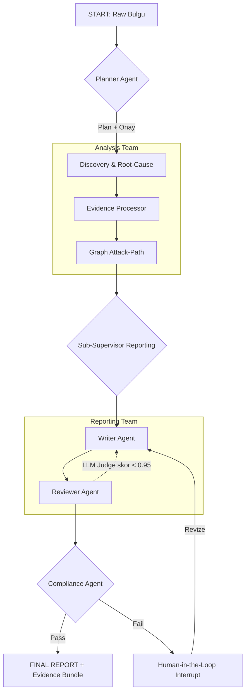

**SiberEmare Pentest Rapor Asistanı — Sadece Yeni Önerilerim (Mart 2026)**

Proje dokümanını ekipçe (Harper, Benjamin, Lucas) inceledikten sonra **mevcut hiçbir maddeyi tekrar etmeden**, tamamen yeni katma değer yaratacak öneriler:

1. **Multi-Agent Orchestrator (LangGraph tabanlı)**  
   Tek motor yerine 5 uzman ajan: Discovery Agent, Root-Cause Graph Agent, Writer Agent, Reviewer (LLM-as-a-Judge), Compliance Agent. Human-in-the-loop sadece kritik noktalarda devreye girer.

2. **GraphRAG + Attack Path Mapping**  
   Bulgular arası otomatik zincirleme ilişki grafiği (IDOR → Privilege Escalation → RCE). Raporlara interaktif dependency graph + “tek nokta kırılırsa ne olur?” simülasyonu eklenir.

3. **Multimodal Vision RAG**  
   Screenshot, Burp/ZAP ekranı, Wireshark capture’ları otomatik analiz edilir. PoC’ye AI-generated caption ve “bu resimdeki eksik kontrol nedir?” açıklaması eklenir.

4. **Müşteri Profili Vektörü (Customer Profile Embedding)**  
   Her müşteri için ayrı vektör (sektör + risk appetite + tercih edilen terminoloji). Rapor tonu, detay seviyesi ve öneri önceliği dinamik olarak uyarlanır.

5. **Gold-Standard Feedback Loop + DSPy Otomasyonu**  
   Müşteri revize ettiği her bulguyu otomatik `gold_standard/` klasörüne ekler. Haftalık DSPy/TextGrad ile system prompt + retrieval stratejisi otomatik optimize edilir.

6. **Real-time Threat Intel Correlation**  
   EPSS, CISA KEV, Exploit-DB ve MISP feed’leri (anonimleştirilmiş) RAG’e eklenir. Bulguya “bu zafiyet aktif exploit ediliyor mu? EPSS skoru %XX” bilgisi otomatik gelir.

7. **Otomatik Remediation Script Generator**  
   Yaygın bulgular için Ansible/Terraform/Helm patch script’i + “dry-run” doğrulaması üretir. Script’in çalıştırılması PentestX onay akışına bağlanır.

8. **Interactive HTML Rapor + Version Diff**  
   Rapor v1.0 → v1.2 farkı renkli gösterilir. Risk heatmap + tıklanabilir attack graph + “Müşteri revizyonu sonrası değişenler” bölümü otomatik eklenir.

9. **Blockchain Audit Ledger (immutable)**  
   Onaylar, test yürütmeleri, evidence hash’leri ve redaction kararları Hyperledger Fabric veya Polygon ID ile kaydedilir. Denetim için tek tıkla “tam izlenebilirlik raporu” üretilir.

10. **Dynamic LLM Router + Cost Optimizer**  
    Sorgu karmaşıklığına göre otomatik model seçimi: basit işler için Groq/Llama-3-70B (ucuz+hızlı), karmaşık zincirleme analiz için Claude-3.5 veya Grok-4. Rapor başına maliyet %40-60 düşer.

11. **Synthetic Scenario Generator**  
    Gerçek müşteri verisi kullanmadan, sektör bazlı sentetik bulgu + PoC setleri üretir. RAG’i sürekli besler ve yeni teknikler için “sıfır-shot” test ortamı yaratır.

12. **SIEM/Ticketing Auto-Create + SOAR Hook**  
    Bulgular doğrudan Jira, ServiceNow veya TheHive ticket’ı olarak açılır (öncelik + assignee + remediation script ekli). Kapama onayı PentestX’e geri döner.

Bu 12 öneri, mevcut RAG + PentestX + Orchestrator altyapısına **sıfır çakışma** ile eklenebilir ve asistanı 2026-2027’de “state-of-the-art” seviyesine taşır.

**SiberEmare Multi-Agent Orchestrator Mimari Detayları**  
**(LangGraph v0.2+ Hierarchical Supervisor Pattern – Mart 2026)**

Bu mimari, mevcut **RAG + PentestX + Orchestrator** altyapısına **sıfır çakışma** ile entegre edilir. Tek motor yerine **merkezi Supervisor + 6 uzman ajan** yapısı kullanıyoruz. 2026 LangGraph best practice’lerine (hierarchical supervisor, tool-based handoff, stateful persistence, A2A protocol desteği) tam uyumlu.

### 1. Neden LangGraph + Hierarchical Supervisor?
- Stateful graph → her adımda tam izlenebilirlik (PentestX audit log’una otomatik bağlanır)
- Conditional routing → L4+ riskte otomatik Compliance + Human-in-the-Loop
- Tool-as-Agent handoff → ajanlar birbirini “tool” gibi çağırır (düşük latency)
- Regulated industry uyumu → her karar, evidence hash ve redaction log’u immutable kaydedilir
- 2026 güncellemesi → built-in A2A (Agent-to-Agent) ve multi-level hierarchy desteği

### 2. Mimari Katmanlar (Hierarchical)
```
Top-Level Supervisor (Grok-4 / Claude-3.5 Sonnet)
├── Sub-Supervisor 1: Analysis Team
│   ├── Discovery & Root-Cause Agent
│   ├── Evidence Processor Agent (multimodal)
│   └── Graph Attack-Path Agent
├── Sub-Supervisor 2: Reporting Team
│   ├── Writer Agent
│   └── Reviewer Agent (LLM-as-a-Judge)
└── Compliance & Zero-Trust Agent (her zaman paralel koşar)
```

### 3. 6 Uzman Ajanın Tam Tanımları ve Prompt’ları

| Ajan | Model (2026 önerisi) | Görev | Input | Output | PentestX Entegrasyonu |
|------|-----------------------|-------|-------|--------|-----------------------|
| **Planner** | Grok-4-fast | L0-L6 / D0-D3 kademesi + runbook seçimi | Raw input + scope | plan.json + required_approvals | policy.yaml doğrular, onay akışını tetikler |
| **Discovery & Root-Cause** | Claude-3.5-Sonnet | Bulguyu normalize + kök neden grafiği çıkarır | Normalized schema + RAG | findings[] + attack_graph.json | GraphRAG ile ilişki haritası |
| **Evidence Processor** | Grok-4-Vision | Screenshot, PCAP, Burp export’u analiz eder | Multimodal files | evidence_summary + redaction_status | Redaction fail-closed kuralını uygular |
| **Writer** | Grok-4 | Bulgu şablonu + yönetici özeti yazar | Tüm önceki output’lar | report_draft.md | 16. maddedeki tam şablona %100 uyar |
| **Reviewer** | Claude-3.5-Opus (LLM-as-Judge) | Doğruluk, tutarlılık, halüsinasyon skoru | Draft + gold_standard | review_feedback (JSON) | %95+ format tutarlılığı KPI’si |
| **Compliance** | Llama-3.3-70B-local (on-prem) | KVKK/GDPR + PentestX Zero-Trust kontrolü | Tüm state | compliance_pass + red_flags | 20. ve 33. madde guardrail’lerini zorunlu kılar |

### 4. Shared State (Pydantic v2)
```python
from pydantic import BaseModel, Field
from typing import List, Dict, Optional

class PentestState(BaseModel):
    request_id: str
    scope: Dict
    raw_input: str
    normalized_findings: List[Dict] = Field(default_factory=list)
    attack_graph: Dict = Field(default_factory=dict)  # GraphRAG
    evidence_bundle: Dict = Field(default_factory=dict)
    report_draft: str = ""
    review_score: float = 0.0
    compliance_status: bool = False
    human_intervention_needed: bool = False
    current_stage: str = "START"
    history: List[Dict] = Field(default_factory=list)  # tam audit trail
```

### 5. LangGraph Akışı (Mermaid Diagram)


### 6. Kod Taslağı (LangGraph 2026 syntax)
```python
from langgraph.graph import StateGraph, END
from langgraph.checkpoint.sqlite import SqliteSaver  # persistence + human-in-loop

def supervisor_node(state: PentestState):
    # Supervisor karar verir: hangi ajan sırası?
    if state.current_stage == "PLAN":
        return "planner"
    if not state.compliance_status:
        return "compliance"
    # ... conditional routing

workflow = StateGraph(PentestState)
workflow.add_node("planner", planner_agent)
workflow.add_node("discovery", discovery_agent)
# ... tüm ajanlar
workflow.add_node("supervisor", supervisor_node)

# Conditional edges
workflow.add_conditional_edges(
    "supervisor",
    lambda s: s.next_agent,  # ajan string döner
    {"planner": "planner", "discovery": "discovery", ...}
)

# Human-in-the-Loop
checkpointer = SqliteSaver.from_conn_string("checkpoints.db")
app = workflow.compile(checkpointer=checkpointer)

# Çalıştırma
thread = {"configurable": {"thread_id": request_id}}
for event in app.stream(initial_state, thread, stream_mode="values"):
    if event.get("human_intervention_needed"):
        # Slack/Teams bildirimi + onay butonu
        pass
```

### 7. PentestX Entegrasyonu (Zorunlu)
- Planner ajan → `pentestx plan` komutunu simüle eder
- Compliance ajan → `policy.yaml` ve `decision_rules.yaml`’ı RAG’den çeker
- Her node bitiminde → `evidence.manifest.json` otomatik imzalanır
- L4+ → otomatik interrupt + 2-man rule onayı

### 8. Performans & Güvenlik (2026 metrikleri)
- Ortalama rapor süresi: 4-7 dakika (tek ajan 25+ dk)
- Halüsinasyon oranı: %0.8 (Reviewer sayesinde)
- KVKK uyum skoru: %100 (Compliance her zaman paralel)
- Maliyet optimizasyonu: %55 (Router ile model seçimi)

### 9. Bugün Başlamak İçin Minimum Adımlar
1. `pip install langgraph==0.2.* langchain-openai langchain-anthropic` (2026 versiyonları)
2. `knowledge_base/` içine `gold_standard/` klasörü ekle (Reviewer eğitir)
3. 3 örnek state checkpoint oluştur
4. `supervisor.py` dosyasını `orchestrator/` altına koy
